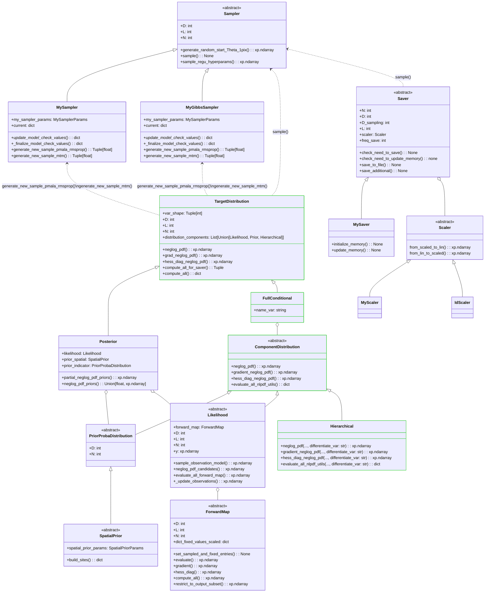
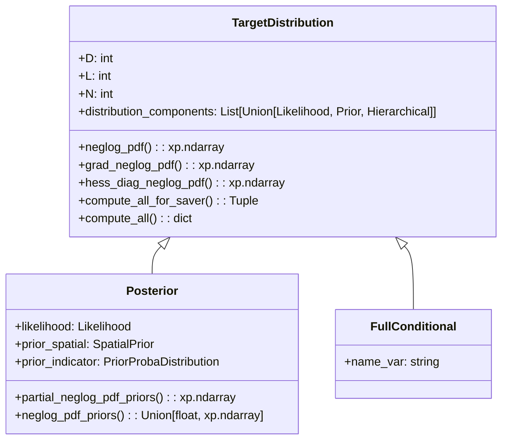
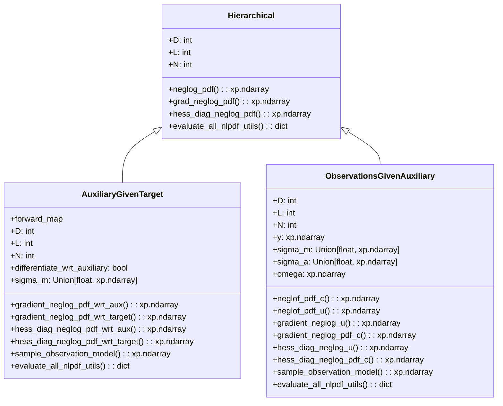
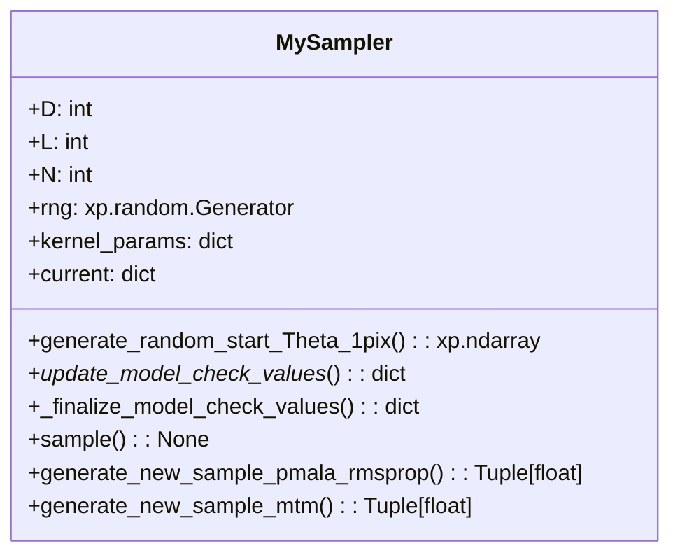

# Mermaid diagrams for code structure: beetroots

In the following, ```xp``` could be either ```np``` for numpy or ```cp``` for cupy.

For the moment we do not introduce the kernel point of view in which the sampler is given kernels. We will keep  the current kernel $K$, i.e. combination of a PMALA kernel $K_1$ and a MTM $K_2$. We will use a kernel $K$ for each variable we are sampling from. In the future we would like to be able to send a single kernel to the sampler so that this one is not overloaded and remains a simple object.
What we are doing currently is in a sense implementing a Gibbs sampler which could be made of single distribution if we provide a single distribution. In that case it is therefore just a single kernel $K$.

## How to incorporate the Hierarchical sampler?

### 1. Kernel partially hard-coded in the ```Sampler``` object (current approach):
  * Probably easier to implement first
  * Would still require some effort to change the way we run the MCMC (setup process, e.g. ```Simulation``` and ```RunMCMC``` object). ```.yaml``` simulation files have parameters that are 'posterior approach dependent'. 
  * See the ```Sampler``` object as Gibbs sampler where each conditional distribution is sampled using a composition of PMALA and a MTM kernel. There might be a single conditional distribution. In this special case it boils down to the original problem of having a single target distribution, typically a classical posterior distribution.
  * This is partially implemented in the ```hierarchical_sampler``` branch of Pierre's repository. The main issue is more about the terminology and we need to think about to generalize it to possible other hierarchical models.
  
### 2. Kernel view: 
  * The sampler is just a loop. 
  * We provide the ```Sampler``` object a kernel built upstream.
  * There is a big work in redifining how do we instantiate all the objects.
  * It is the user's reponsability to provide a target distribution that contains the necessary methods for the kernel.
  * The problem in this approach is that the kernel becomes a huge object. We just transfer the issues from the sampler to the kernel.

### Choice!

We have decided to go with the **first option** in order to have something that could run in the time of the internship. It is also not sure yet how the second part will be shared across all projects so we won't dive into it too fast. We will describe here under how we plan/try to implement this approach in a generic manner.

By generic we mean a Gibbs sampler that could be used with several hierarchical models.

The ```beetroots``` library can be seen as 3 major blocks.

* **Sampler + modellingmodelling:** by  we mean all the classes that enable us to specify our statistical model, e.g. priors, likelihoods, posteriors, full conditionals and other component distributions. The sampler object will receive this modelling objects in order to proceed to the MCMC algorithms in itself.
* **Simulations + RunMCMC:** in practice these elements precede the sampler and the modelling classes. Indeed, the ```Simulations``` and ```RunMCMC``` objects will instantiate our problems from a ```yaml``` file and command line arguments. It can for example run several MCMC chains in parallel with different sets of hyperparameters.
* **Saver + ExtractorResults:** the saver object is simply an object that will save sequentially the current state of our MCMC process in order to start back from a checkpoint (random seeds are stored). The ```ExtractorResults``` is big tool that will create all the figures, plot, statistics related to our MCMC process (including model checking).

We will address all of these blocks in the rest of the document.

## 1. Global modelling + sampler

In the following diagram, classes in green represent classes that were not present in the initial code structure and that were added for the sake of generalization.



<!-- style Sampler fill:#030303 -->

The ```Hierarchical``` class is used for component distributions that appear in several ```FullConditional``` object. Indeed, we might want to differentiate with respect to one variable or another depending on the full conditional. Therefore, these component distributions implement one sub gradient method for each variable. When the ```FullConditional``` object, which inheritates from ```TargetDistribution```, computes derivatives of the neglog pdf of its components, it first checks if the component is an instance of a ```Hierarchical``` component distribution to add the ```name_var``` or not to the input parameters (hidden in a ```**kwargs``` argument in the abstract class).
A ```FullConditional``` object does not necessarily have a ```Hierarchical``` object as component, e.g. our problem.

<!-- ## Target distribution
We want to extend the distributions we are sampling from further than just posterior distributions. Indeed, some sampling such as Gibbs samplers require to deal with full conditionals where the likelihood/prior is not perfectly appropriate anymore. Especially if we combine it with a hierarchical comprising auxiliary variables as we do.


### Distribution components

The target distribution is therefore made of several **distribution components**. They can be *picked* in a kind of bank of distributions made of: **likelihoods**, **priors**, **hierarchical**, etc.
The **hierarchical** term here is used as generic term to talk about distributions that are not likelihood or priors and that are used in our hierarchical approach. This might change as we make the terminology evolves.

Both the priors and the likelihood objects have not been changed from the original code so we will just describe the new **Hierarchical** components.



Actually, priors and likelihood abstract objects have been modified to incorporate by default a ```evaluate_all_nlpdf_utils()``` method. This method is used to precompute quantities that will be used througout the computations of the neglog pdf and its derivatives so that we do not duplicate computations. This can simply be for example $\log u$ or some more complicated functions such as in the approximate mixing model of the original implementation.


## Sampler

```mermaid
graph TD;
    subgraph Inputs
        subgraph target_distributions
            A[TargetDistribution #1];
            Dot["..."];
            B[TargetDistribution #N]
        end
        C[Saver];
        D[max_iter];
        E[vars_0];
        G[regu_spatial_params];
    end

    target_distributions --\> F["MySampler.sample()"]
    C --\> F;
    D --\> F;
    E --\> F;
    G --\> F;
    F --\> Output[Output];

    style Dot fill:transparent,stroke-width:0px;
``` 
-->

 **Focus on the initial sampler**



The ```current``` attribute (dict) contain the following keys:
- *Theta*
- *forward_map_evals*
- *nll_utils*
- *objective_pix*
- *objective*
- *grad*
- *hess_diag*

We do not necessarily need to have the ```nll_utils``` or the ```forward_map_evals``` in the sampler as it would be messy with hierarchical models, speciafically for the ```nll_utils```. Moreover, if they are put in the sampler there might be duplicates as some distributions appear in different full conditionals.


## 2. Simulations and RunMCMC

### 2.1 Simulations
Let's have a mermaid chart for everything that concerns the launch of a simulation. This incorporates files related to ```Simulation``` and ```RunMCMC``` classes and the children classes. Let us note that we only focus on the sampling solver and not the optimization one referred as *MAP* in the code. ```RunMCMC``` inherits from ```Run``` which also has children ```RunOptimMAP``` and ```RunOptimMLE``` that serve for this optimization approach which again is not of our interest here.


```mermaid
classDiagram
    class Simulation {
        <<abstract>>
    }

    class SimulationRealData {
    }

    class AstroSimulation {
    }

    class SimulationForwardMap {
        <<abstract>>
    }

    class SimulationNN {
    }

    class SimulationPolynomialReg{
    }

    class SimulationObservation{
        <<abstract>>
    }
    
    class SimulationRealData{
    }

    class SimulationToyCase{
    }

    class SimulationPosteriorType{
        <<abstract>>
    }

    class SimulationMySampler{
    }

    class SimulationMyGibbsSampler{
    }

    class SimulationRealDataNN{
    }

    class SimulationToyCaseNN{
    }

    class SimulationGaussianMixture{
    }

    class SensorLocalizationSimulation{
    }

    Simulation <|-- AstroSimulation
    AstroSimulation <|-- SimulationForwardMap
    SimulationForwardMap <|-- SimulationNN
    SimulationForwardMap <|-- SimulationPolynomialReg
    AstroSimulation <|-- SimulationObservation
    SimulationObservation <|-- SimulationRealData
    SimulationObservation <|-- SimulationToyCase
    SimulationPosteriorType <|-- SimulationMySampler
    SimulationPosteriorType <|-- SimulationMyGibbsSampler
    Simulation <|-- SimulationRealData
    SimulationRealData <|-- SimulationRealDataNN
    SimulationNN <|-- SimulationRealDataNN
    SimulationMySampler <|-- SimulationRealDataNN
    SimulationNN <|-- SimulationToyCaseNN
    SimulationToyCase <|-- SimulationToyCaseNN
    SimulationMySampler <|-- SimulationToyCaseNN
    SimulationPolynomialReg <|-- SimulationToyCasePolyReg
    SimulationToyCase <|-- SimulationToyCasePolyReg
    SimulationMySampler <|-- SimulationToyCasePolyReg
    Simulation <|-- SimulationGaussianMixture
    Simulation <|-- SensorLocalizationSimulation

    style SimulationMyGibbsSampler stroke: #32CD32, stroke-dasharray: 5 5
    style SimulationPosteriorType stroke: #ED7F10, stroke-dasharray: 5 5
    style SimulationMySampler stroke: #ED7F10, stroke-dasharray: 5 5
    style AstroSimulation stroke: #ED7F10
    style SimulationRealDataNN stroke: #ED7F10
    style SimulationToyCaseNN stroke: #ED7F10
    style SimulationToyCasePolyReg stroke: #ED7F10


 ```

In order to switch to the hierarchical approach which is itself based on a Gibbs sampling approach, we have to understand what parts of this simulation class schema will need to be adapted or not.

This whole hierarchy is here to simplify the code by having classes with specfific roles. For simpler problems (not astro with real or toy data), everything is embedded in a single class.

**Classes with an ```__init__``` method:**

* ```AstroSimulation```
* ```SimulationGaussianMixture```
* ```SensorLocalizationSimulation```

**Classes with a dependence on the ```Posterior``` point of view:**

* ```SimulationObservation```:
  * ```save_and_plot_setup``` method requires **dict_posteriors** and use **likelihood** and **prior** parameters.
* ```SimulationPosteriorType``` (will not be adapted as it the purpose, we should propose an equivalent):
  * ```setup_posteriors``` is just an abstract class but suggests that we use ```Posterior``` instances.
* ```SimulationMySampler``` (again normal since it is its purpose to work with ```Posterior``` objects):
  * all the methods refer to ```Posterior``` instances.
* ```SimulationRealDataNN```:
  * all its methods are also based on ```Posterior``` objects since it is based on ```MySampler``` which was created according to the posterior point of view.
* ```SimulationToyCaseNN```:
  * all its methods are also based on ```Posterior``` objects since it is based on ```MySampler``` which was created according to the posterior point of view.
* ```SimulationToyCasePolyreg```:
  * all its methods are also based on ```Posterior``` objects since it is based on ```MySampler``` which was created according to the posterior point of view.
  
**Conclusions on updates:**

We need to create/modify a few new ```Simulation``` classes for the Gibbs sampling/hierarchical approach:

* Rename ```SimulationPosteriorType``` to ```SimulationTargetDistributionType``` and rename the abstract method ```setup_posteriors``` to ```setup_target_distributions```.
* Create a class ```SimulationMyGibbsSampler``` which is an equivalent of the ```SimulationMySampler``` for the Gibbs sampler approach.
* We must modify the ```AstroSimulation``` since the ```__init__``` method is based on the current ```.yaml``` file.
* We would like to modify ```SimulationRealDataNN```, ```SimulationToyCaseNN``` and ```SimulationToyCasePolyreg``` so that it can fit any ```SimulationTargetDistributionType``` child class. Currently, the ```SimulationMySampler``` is hard-coded in it which is not ideal. We do not want to recreate a simulation class for each new kernel. We might need to remove the ```SimulationTargetDistributionType``` classes to use scripts instead. For each kernel we should just defined the way to deal with the params. The setup_posterior might come from a utils script which just takes the params dict.
* All this framework is considered with a single set of observations so a single likelihood. For multimodality which would involve more likelihoods we should extend the approach.

### 2.2. RunMCMC

## 3. Saver + ResultsExtractor

### 3.1. Saver

The saver object is not too complex and should not be very difficult to adapt to our ```GibbsSampler``` object. There is still a sensitive point cocnerning some objects that are saved. In the intial implementation attributes such as ```forward_map_eval``` were stored. However, with our new implementation this attribute for example is stored in the likelihood object and not in the sampler anymore. It might therefore not be easy to access it if it needs to be saved in order to be used in the ```ResultsExtractor``` object.

### 3.2. ResultsExtractor

The results extractor will call different objects, each responsible to produce some figures or statistics. Here are the followings tasks that are asked by the extarctor main object:

* <span style="color:green">**step 1**</span> : clppd, i.e. computed log point-wise predictive density (see ``beetroots.inversion.results.utils.clppd``)
  * This should be done only once for the whole statistical model.
  * This still have a very strong dependence on the posterior approach (maybe not when we look at it since everything is already computed, to check!)
* <span style="color:red">**step 2**</span> : kernel analysis (see ``beetroots.inversion.results.utils.kernel``)
  * Related to the acceptance rates of both kernels.
* <span style="color:red">**step 3**</span> : objective evolution (see ``beetroots.inversion.results.utils.objective``) (the objective is the negative log posterior pdf)
* <span style="color:red">**step 4**</span> : MAP estimator from samples (see ``beetroots.inversion.results.utils.lowest_obj_estimator``)
  * It uses the ``Scaler`` object.
* <span style="color:red">**step 5**</span> : deal with whole Markov chain for MMSE and histograms, in a pixel-wise approach to avoid overloading the memory (see ``beetroots.inversion.results.utils.mc``)
  * It uses the ``Scaler`` object.
* <span style="color:red">**step 6**</span> : save global MMSE performance (see ``beetroots.inversion.results.utils.mmse_ci``)
  * It uses the ``target_distribution`` and ``Scaler`` objects.
* <span style="color:red">**step 7**</span> (if map) : plot maps of ESS (see ``beetroots.inversion.results.utils.ess_plots``)
  * ESS is computed in step 5.
* <span style="color:green">**step 8**</span> : model checking with Bayesian p-value computation (see ``beetroots.inversion.results.utils.bayes_pval_plots``)
* <span style="color:red">**step 9**</span> (if the true value is known): plot how many components have their true value between min and max of Markov chain (see ``beetroots.inversion.results.utils.valid_mc``)
* <span style="color:orange">**step 10**</span> : plot comparison of distributions of :math:`y_n` and :math:`f(\theta_n)` for all :math:`n \in [\![1, N]\!]` (see ``beetroots.inversion.results.utils.y_f_Theta``)
  * It uses the ``ForwardMap`` and ``Scaler`` objects!
* <span style="color:red">**step 11**</span> (if ``analyze_regularization_weight``) : analysis of the regularization weight :math:`\tau` automatic tuning (see ``beetroots.inversion.results.utils.regularization_weights``)

The extractor itself uses the ```Posterior``` and the ``ForwardMap`` objects. We need to find a way to provide the ``ForwardMap`` object in the new approach.

In <span style="color:red">red</span> are the statistics that can (must?) be computed for each variable involved. In <span style="color:green">green</span> are the sattistics related to the model as whole and which are therefore computed once. In <span style="color:orange">orange</span> are the statistics that are related to a specific variable but which are still not related to the model as whole.
