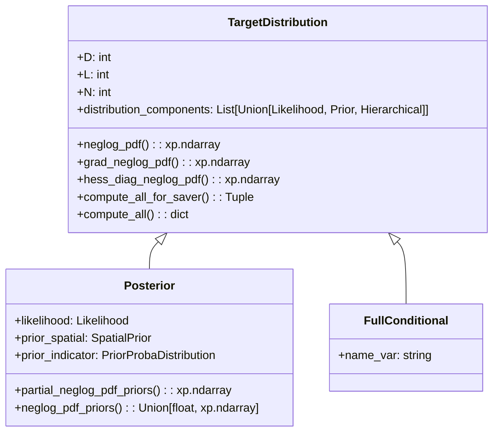
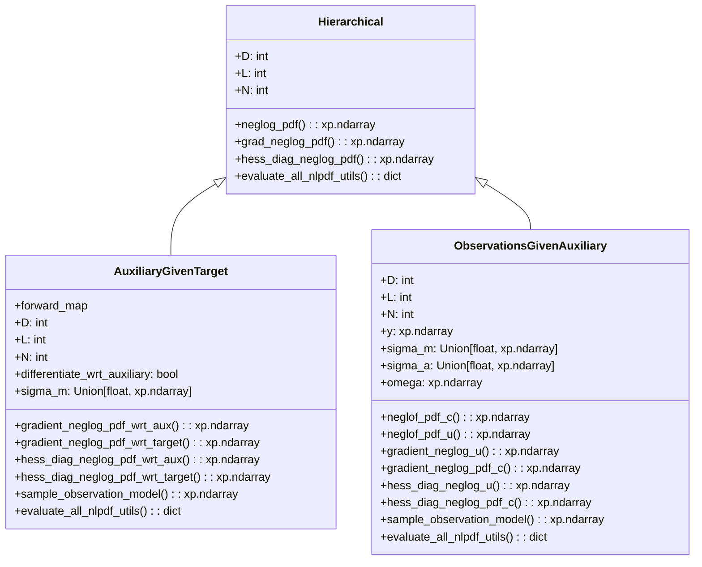
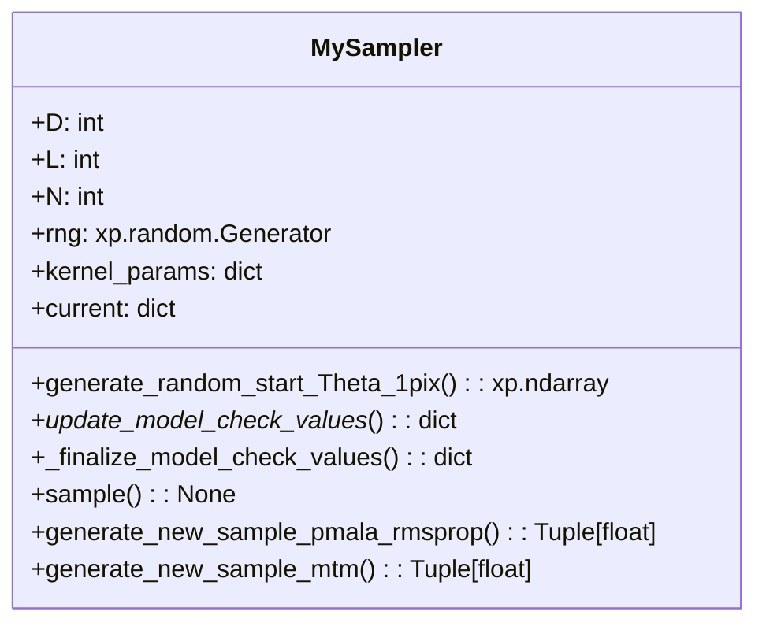

# Mermaid diagrams for code structure: beetroots

In the following, ```xp``` could be either ```np``` for numpy or ```cp``` for cupy.

For the moment we do not introduce the kernel point of view in which the sampler is given kernels. We will keep  the current kernel $K$, i.e. combination of a PMALA kernel $K_1$ and a MTM $K_2$. We will use a kernel $K$ for each variable we are sampling from. In the future we would like to be able to send a single kernel to the sampler so that this one is not overloaded and remains a simple object.
What we are doing currently is in a sense implementing a Gibbs sampler which could be made of single distribution if we provide a single distribution. In that case it is therefore just a single kernel $K$.

## Global

In the following diagram, classes in green represent classes that were not present in the initial code structure and that were added for the sake of generalization.

```mermaid
classDiagram
    class Sampler {
        <<abstract>>
        +D: int
        +L: int
        +N: int
        +generate_random_start_Theta_1pix(): xp.ndarray
        +sample(): None
        +sample_regu_hyperparams(): xp.ndarray
    }

    class MySampler {
        +my_sampler_params: MySamplerParams
        +current: dict
        +_update_model_check_values_(): dict
        +_finalize_model_check_values(): dict
        +generate_new_sample_pmala_rmsprop(): Tuple[float]
        +generate_new_sample_mtm(): Tuple[float]
    }

    class Saver {
        <<abstract>>
        +N: int
        +D: int
        +D_sampling: int
        +L: int
        +scaler: Scaler
        +freq_save: int
        +check_need_to_save(): None
        +check_need_to_update_memory(): none
        +save_to_file(): None
        +save_additional(): None
    }

    class MySaver {
        +initialize_memory(): None
        +update_memory(): None
    }

    class Scaler{
        <<abstract>>
        from_scaled_to_lin(): xp.ndarray
        from_lin_to_scaled(): xp.ndarray
    }

    class IdScaler{
    }

    class MyScaler{
    }

    class TargetDistribution {
        +D: int
        +L: int
        +N: int
        +distribution_components: List[Union[Likelihood, Prior, Hierarchical]]
        +neglog_pdf(): xp.ndarray
        +grad_neglog_pdf(): xp.ndarray
        +hess_diag_neglog_pdf(): xp.ndarray
        +compute_all_for_saver(): Tuple
        +compute_all(): dict
    }

    class Posterior {
        +likelihood: Likelihood
        +prior_spatial: SpatialPrior
        +prior_indicator: PriorProbaDistribution
        +partial_neglog_pdf_priors(): xp.ndarray
        +neglog_pdf_priors(): Union[float, xp.ndarray]
    }

    class FullConditional {
        +name_var: string
    }

    class ComponentDistribution {
        <<abstract>>
        +neglog_pdf(): xp.ndarray
        +gradient_neglog_pdf(): xp.ndarray
        +hess_diag_neglog_pdf(): xp.ndarray
        +evaluate_all_nlpdf_utils(): dict
    }

    class PriorProbaDistribution {
        <<abstract>>
        +D: int
        +N: int
    }

    class SpatialPrior {
        <<abstract>>
        +spatial_prior_params: SpatialPriorParams
        +build_sites(): dict
    }

    class Likelihood {
        <<abstract>>
        +forward_map: ForwardMap
        +D: int
        +L: int
        +N: int
        +y: xp.ndarray
        +sample_observation_model(): xp.ndarray
        +neglog_pdf_candidates(): xp.ndarray
        +evaluate_all_forward_map(): xp.ndarray
        +_update_observations(): xp.ndarray
    }

    class Hierarchical {
        +neglog_pdf(..., differentiate_var: str): xp.ndarray
        +gradient_neglog_pdf(..., differentiate_var: str): xp.ndarray
        +hess_diag_neglog_pdf(..., differentiate_var: str): xp.ndarray
        +evaluate_all_nlpdf_utils(..., differentiate_var: str): dict
    }

    class ForwardMap {
        <<abstract>>
        +D: int
        +L: int
        +N: int
        +dict_fixed_values_scaled: dict
        +set_sampled_and_fixed_entries(): None
        +evaluate(): xp.ndarray
        +gradient(): xp.ndarray
        +hess_diag(): xp.ndarray
        +compute_all(): xp.ndarray
        +restrict_to_output_subset(): xp.ndarray
    }


    Sampler <|-- MySampler
    Sampler <.. TargetDistribution: sample()
    MySampler <.. TargetDistribution: generate_new_sample_pmala_rmsprop()\ngenerate_new_sample_mtm()
    Sampler <.. Saver: sample()
    Saver <|-- MySaver
    Saver o-- Scaler
    Scaler <|-- MyScaler
    Scaler <|-- IdScaler
    TargetDistribution o-- ComponentDistribution
    TargetDistribution <|-- Posterior
    TargetDistribution <|-- FullConditional
    ComponentDistribution <|-- PriorProbaDistribution
    ComponentDistribution <|-- Likelihood
    ComponentDistribution <|-- Hierarchical
    PriorProbaDistribution <|-- SpatialPrior
    Posterior o-- PriorProbaDistribution
    Posterior o-- Likelihood
    Likelihood o-- ForwardMap

    <!-- style Sampler fill:#030303 -->
    style ComponentDistribution stroke:#32CD32
    style Hierarchical stroke:#32CD32
    style TargetDistribution stroke:#32CD32
    style FullConditional stroke:#32CD32
```

The ```Hierarchical``` class is used for component distributions that appear in several ```FullConditional``` object. Indeed, we might want to differentiate with respect to one variable or another depending on the full conditional. Therefore, these component distributions implement one sub gradient method for each variable. When the ```FullConditional``` object, which inheritates from ```TargetDistribution```, computes derivatives of the neglog pdf of its components, it first checks if the component is an instance of a ```Hierarchical``` component distribution to add the ```name_var``` or not to the input parameters (hidden in a ```**kwargs``` argument in the abstract class).
A ```FullConditional``` object does not necessarily have a ```Hierarchical``` object as component, e.g. our problem.

<!-- ## Target distribution
We want to extend the distributions we are sampling from further than just posterior distributions. Indeed, some sampling such as Gibbs samplers require to deal with full conditionals where the likelihood/prior is not perfectly appropriate anymore. Especially if we combine it with a hierarchical comprising auxiliary variables as we do.


### Distribution components

The target distribution is therefore made of several **distribution components**. They can be *picked* in a kind of bank of distributions made of: **likelihoods**, **priors**, **hierarchical**, etc.
The **hierarchical** term here is used as generic term to talk about distributions that are not likelihood or priors and that are used in our hierarchical approach. This might change as we make the terminology evolves.

Both the priors and the likelihood objects have not been changed from the original code so we will just describe the new **Hierarchical** components.



Actually, priors and likelihood abstract objects have been modified to incorporate by default a ```evaluate_all_nlpdf_utils()``` method. This method is used to precompute quantities that will be used througout the computations of the neglog pdf and its derivatives so that we do not duplicate computations. This can simply be for example $\log u$ or some more complicated functions such as in the approximate mixing model of the original implementation.

## Sampler




```mermaid
graph TD;
    subgraph Inputs
        subgraph target_distributions
            A[TargetDistribution #1];
            Dot["..."];
            B[TargetDistribution #N]
        end
        C[Saver];
        D[max_iter];
        E[vars_0];
        G[regu_spatial_params];
    end

    target_distributions --\> F["MySampler.sample()"]
    C --\> F;
    D --\> F;
    E --\> F;
    G --\> F;
    F --\> Output[Output];

    style Dot fill:transparent,stroke-width:0px;
``` 

-->
